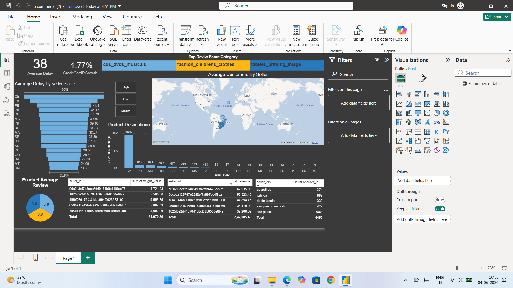

# E-Commerce Power BI Dashboard

## Project Overview

This project presents an interactive Power BI dashboard for analyzing e-commerce sales performance. The dashboard helps understand revenue trends, profit performance, customer behavior, product category performance, and regional sales insights.

## Business Objective

The objective of this project is to analyze e-commerce business data and identify key insights that can help improve sales performance, profitability, and business decision-making.

## Tools Used

- Power BI
- Power Query
- DAX
- Data Visualization
- Business Intelligence

## Key KPIs

- Total Sales
- Total Profit
- Total Quantity Sold
- Average Order Value
- Sales by Category
- Sales by Region
- Monthly Sales Trend
- Top Performing Products

## Dashboard Features

- Interactive Power BI dashboard
- Sales and profit analysis
- Product category performance
- Region-wise business performance
- Customer and order analysis
- Monthly trend analysis
- Business insights for decision-making

## Key Business Insights

- Identified top-performing product categories.
- Analyzed sales and profit trends over time.
- Compared regional sales performance.
- Found key areas contributing to revenue and profitability.
- Created an interactive dashboard for better business reporting.

## Project File

The Power BI dashboard file is available here:

[e commerce.pbix](./e%20commerce.pbix)

## Author

Sumit Joshi
